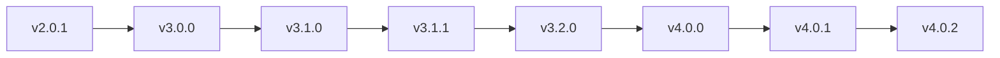

# TEXTRADER X Version Lineage


```mermaid
flowchart LR
    V201["v2.0.1"] --> V300["v3.0.0"]
    V300 --> V310["v3.1.0"]
    V310 --> V311["v3.1.1"]
    V311 --> V320["v3.2.0"]
    V320 --> V400["v4.0.0"]
    V400 --> V401["v4.0.1"]
    V401 --> V402["v4.0.2"]
```

Canonical release tags:

```text
v2.0.1
v3.0.0
v3.1.0
v3.1.1
v3.2.0
v4.0.0
v4.0.1
v4.0.2
```

Release-specific source and documentation remain under `releases/`.
